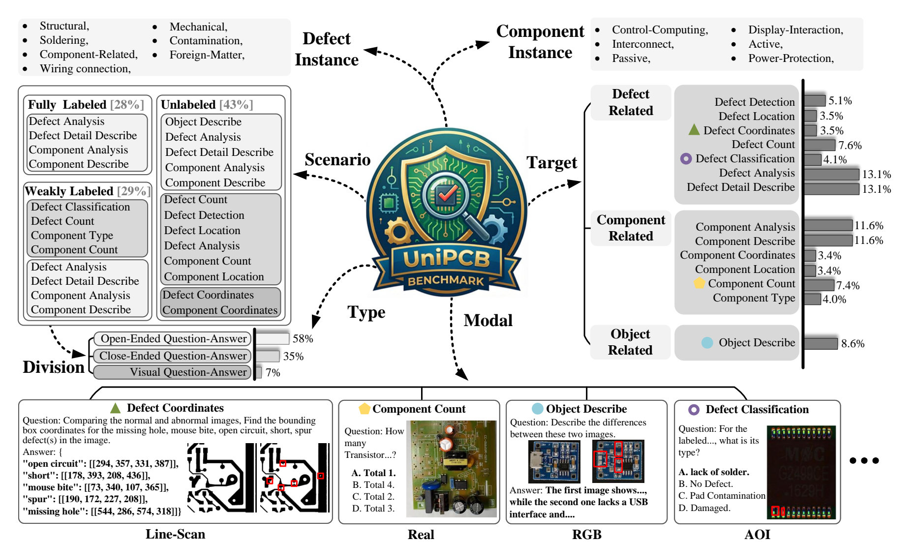
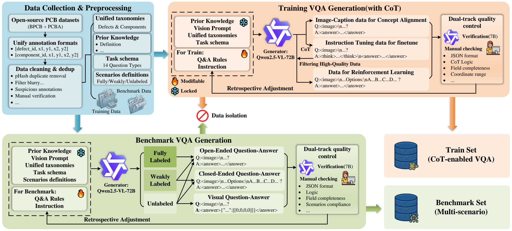
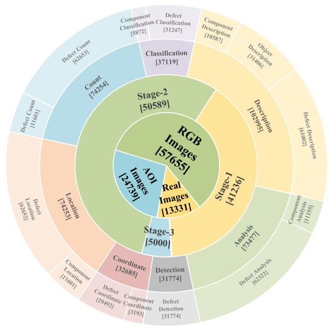

# UniPCB: A Unified Vision-Language Benchmark for PCB Quality Inspection

[](https://github.com/M-3LAB/awesome-industrial-anomaly-detection)
[]()
[](https://arxiv.org/abs/2601.19222)
[]()



## 💡 Highlights
- First unified vision-language benchmark covering both BPCB and PCBA inspection levels
- 3 progressive annotation scenarios (fully / weakly / unlabeled) to evaluate model robustness under varying information density
- 14 inspection subtasks spanning detection, counting, classification, localization, defect analysis and reinspection recommendations
- PCB-GPT: specialized MLLM with 3-stage curriculum learning, doubling defect localization performance over general-purpose models

## 📜 News
- **[2026-03-10]** Repository and preprint paper released
- **[2026-01-25]** UniPCB preprint published on arXiv
- **[2025-12-20]** PCB-GPT achieves new SOTA on all PCB inspection benchmarks

## Overview
UniPCB is the first unified vision-language benchmark tailored for open-ended PCB quality inspection tasks. It systematically integrates and standardizes multi-source PCB data across BPCB and PCBA inspection levels, covering 3 annotation scenarios and 14 quality inspection subtasks.

We also propose **PCB-GPT**, a specialized vision-language assistant for PCB inspection trained with a three-stage curriculum learning strategy, which achieves state-of-the-art performance on fine-grained defect localization and interpretable reasoning tasks.

## Data Construction Pipeline


Our systematic data construction pipeline unifies:
1. Multi-source data collection across different imaging modalities
2. Standardized annotation protocols for defects and components
3. Unified taxonomy with 7 defect categories and 6 component functional domains
4. Dual-track quality control for both training set and benchmark generation

## Dataset Composition


Rings from inner to outer represent imaging modalities (RGB/AOI/Real), data construction stages, and task families with fine-grained sample counts.

The UniPCB benchmark contains:
- 6k high-quality PCB images
- 23k multi-modal question-answer pairs
- 3 annotation scenarios (fully labeled / weakly labeled / unlabeled)
- 14 inspection subtasks covering detection, counting, classification, localization, defect analysis and reinspection recommendations

## 🚀 Quick Start
### Environment Setup
```bash
# Clone repository
git clone https://github.com/your-username/UniPCB.git
cd UniPCB

# Install dependencies
pip install -r requirements.txt
```

### Dataset Preparation
1. Download the UniPCB dataset from [Hugging Face]() (coming soon after paper publication)
2. Unzip the dataset to `dataset/` directory:
```bash
unzip unipcb_dataset.zip -d dataset/
```

### Run Evaluation
Evaluate your model on the UniPCB benchmark:
```bash
# Evaluate all scenarios
python evaluation/evaluate.py --model <your-model-path> --scenario all

# Evaluate specific scenario
python evaluation/evaluate.py --model <your-model-path> --scenario fully_labeled
```

### Reproduce PCB-GPT Results
We provide the pre-trained PCB-GPT model for reproduction:
```bash
# Download pre-trained model
wget <model-url> -O models/pcb_gpt.pth

# Run evaluation
python evaluation/evaluate.py --model models/pcb_gpt.pth --scenario all
```

## 📊 Main Experiment Results
Quantitative comparison on the UniPCB Benchmark across different model categories. **Bold** = best performance, <u>Underline</u> = second-best performance within each category. P1/P2/P3 = fully/weakly/unlabeled settings.

| Model Category | Model | Size | P1 Acc | P2 Acc | P3 Acc | Localization F1 | Overall Score |
|----------------|-------|------|--------|--------|--------|------------------|---------------|
| **Commercial MLLM** | GPT-4o | - | 64.2% | 58.7% | 61.0% | 31.2% | 56.2% |
| | Gemini-1.5 Pro | - | 62.7% | 55.4% | 57.8% | 28.9% | 52.8% |
| | Doubao-VL 4.0 | - | <u>65.6%</u> | <u>60.1%</u> | <u>62.3%</u> | <u>32.8%</u> | <u>57.4%</u> |
| | Qwen-VL-Max | - | **68.1%** | **62.3%** | **65.7%** | **34.1%** | **60.5%** |
| **IAD Models** | AnomalyGPT | 7B | 22.1% | 18.7% | 20.4% | 12.3% | 21.2% |
| | IAD-VL | 7B | 28.7% | 24.5% | 26.1% | 15.7% | 26.8% |
| **Open Source MLLM** | Qwen2.5-VL | 7B | 53.2% | 44.2% | 66.7% | 22.3% | 55.0% |
| | Qwen3-VL-Instruct | 8B | 61.5% | 48.7% | 64.8% | 22.2% | <u>58.6%</u> |
| | PCB-GPT (Ours) | 7B | **72.5%** | **66.4%** | **73.4%** | **51.1%** | **67.3%** |

## 📚 PCB Dataset Catalog
Below is the full comprehensive catalog of PCB datasets surveyed for UniPCB construction (similar to the SOTA methods list in awesome-industrial-anomaly-detection):

### Defect-only Datasets
| Dataset | PCB Type | Modality | Target | # Categories | # Images | Link |
|---------|----------|----------|--------|--------------|----------|------|
| HRIPCB | BPCB | RGB | Defect | 6 | 1386 | [pkusz.edu.cn](https://robotics.pkusz.edu.cn/resources/dataset/) |
| HRIPCB-Augmented | BPCB | RGB | Defect | 6 | 10668 | [GitHub](https://github.com/Ixiaohuihuihui/Tiny-Defect-Detection-for-PCB) |
| DeepPCB | BPCB | Line-Scan | Defect | 6 | 3000 | [GitHub](https://github.com/tangsanli5201/DeepPCB) |
| PCB-AoI | PCBA | AOI | Defect | 1 | 1211 | [Kaggle](https://www.kaggle.com/datasets/kubeedgeianvs/pcb-aoi/data) |
| PCBA-DET | PCBA | Real | Defect | 8 | 4601 | [GitHub](https://github.com/ismh16/PCBA-Dataset?tab=readme-ov-file) |
| Solder Joint Dataset | PCBA | Real | Defect | 5 | 3390 | [GitHub](https://github.com/furkanulger/solder-joint-dataset?tab=readme-ov-file) |
| Dataset-PCB | PCBA | Real | Defect | 2 | 3196 | [GitHub](https://github.com/asrf001/DatasetPCB/tree/master) |
| DsPCBSD+ | BPCB | AOI | Defect | 9 | 10259 | [GitHub](https://github.com/kikopapa/PCB_Defect_Detection) |
| PCB-Defect-Detection-Image-Registration | BPCB | Line-Scan | Defect | 6 | 20 | [GitHub](https://github.com/vihangp/PCB-Defect-Detection-using-Image-Registration/tree/master) |
| Defects Dataset | PCBA | Real | Defect | 5 | 484 | [Roboflow](https://universe.roboflow.com/diplom-qz7q6/defects-2q87r/dataset/12) |
| PCB-Defect-Detection | PCBA | RGB | Defect | 6 | 898 | [Roboflow](https://universe.roboflow.com/research-zdvjv/pcb_defect_detection-3ecqi) |
| Mono_PCB Dataset | PCBA | RGB | Defect | 16 | 248 | [Roboflow](https://universe.roboflow.com/detectpcb/mono_pcb) |
| Mixed PCB defect | BPCB | RGB | Defect | 6 | 1741 | [Mendeley](https://data.mendeley.com/datasets/fj4krvmrr5/2) |
| Bangla_PCB_yolo | BPCB | RGB | Defect | 6 | 1196 | [Kaggle](https://www.kaggle.com/datasets/rawadjashid/bangla-pcb-yolo) |
| MRC-DETR | BPCB | AOI | Defect | 3 | 800 | [GitHub](https://github.com/utopiawsw/MRC-DETR) |
| U-PCBD | BPCB | Ultrasonic | Defect | 5 | 4320 | [iiplab.net](https://iiplab.net/u-pcbd/) |

### Mixed (Defect + Component) Datasets
| Dataset | PCB Type | Modality | Target | # Categories | # Images | Link |
|---------|----------|----------|--------|--------------|----------|------|
| FICS | PCBA | RGB | Mix | 31 | 9912 | [trust-hub.org](https://trust-hub.org/#/data/fics-pcb) |
| VisA (PCB) | PCBA | RGB | Mix | 10 | 4416 | [GitHub](https://github.com/amazon-science/spot-diff) |
| PCB-Bank | PCBA | RGB | Mix | 11 | 2333 | [GitHub](https://github.com/SSRheart/PCB-Bank?tab=readme-ov-file) |
| PCB-Resistor-Defect-Dataset | PCBA | RGB | Mix | 11 | 261399 | [GitHub](https://github.com/leiruoshan/PCB-Resistor-Defect-Dataset?tab=readme-ov-file) |
| PCB_Datasets-main | PCBA | AOI | Mix | 8 | 4748 | [GitHub](https://github.com/YMkai/PCB_Datasets/tree/main) |
| PCB AD | PCBA | RGB | Mix | 5 | 690 | [Kaggle](https://www.kaggle.com/datasets/lhk511/pcb-ad) |
| Multiple Datasets on PCB Defects | BPCB | AOI | Mix | 2 | 18493 | [Kaggle](https://www.kaggle.com/datasets/jiafuwen77/multiple-datasets-on-pcb-defects) |
| MPI-PCB | PCBA | Real | Mix | 2 | 1797 | [GitHub](https://github.com/Diulhio/pcb_anomaly) |

### Component-only Datasets
| Dataset | PCB Type | Modality | Target | # Categories | # Images | Link |
|---------|----------|----------|--------|--------------|----------|------|
| Micro-PCB Images | PCBA | RGB | Component | 13 | 8125 | [Kaggle](https://www.kaggle.com/datasets/frettapper/micropcb-images/data) |
| FPIC | PCBA | AOI | Component | 25 | 6260 | [ece.ufl.edu](https://physicaldb.ece.ufl.edu/index.php/fics-pcb-image-collection-fpic/) |
| PCB oriented detection | PCBA | AoI | Component | 41 | 190 | [Kaggle](https://www.kaggle.com/datasets/yuyi1005/pcb-oriented-detection) |
| PCB Component Detection | PCBA | Real | Component | 9 | 1410 | [DatasetNinja](https://datasetninja.com/pcb-component-detection) |
| PCB-Components-1495 | PCBA | Real | Component | 28 | 830 | [Kaggle](https://www.kaggle.com/datasets/nguyenhoangsoz/pcb-data) |
| PCB-Component-Detection-CVM | BPCB | RGB | Component | 9 | 101 | [Roboflow](https://universe.roboflow.com/research-pbbdl/pcb-component-detection-dre7a) |
| DSLR | PCBA | RGB | Component | 4 | 748 | [tuwien.ac.at](https://cvl.tuwien.ac.at/research/cvl-databases/pcb-dslr-dataset/) |
| PCB-Vision | PCBA | RGB | Component | 4 | 106 | [GitHub](https://github.com/Elias-Arbash/PCBVision) |

### Private/Closed-source Datasets
| Dataset | PCB Type | Modality | Target | # Categories | # Images | Access |
|---------|----------|----------|--------|--------------|----------|--------|
| Lite-On Dataset | PCBA | AOI | Mix | 8 | 12200 | Private |
| AXI_PCB_defect_detection | PCBA | AXI | Mix | 4 | 32377 | Private |
| PCB-METAL | PCBA | RGB | Component | 4 | 984 | Private |
| PCBMO | PCBA | RGB | Component | 4 | 3773 | Private |
| PCBSDD | PCB | RGB | Component | 6 | 19029 | Private |


## Citation
```
@article{sun2026unipcb,
  title={UniPCB: A Unified Vision-Language Benchmark for Open-Ended PCB Quality Inspection},
  author={Sun, Fuxiang and Jiang, Xi and Wu, Jiansheng and Zhang, Haigang and Zheng, Feng},
  journal={arXiv preprint arXiv:2601.19222},
  year={2026}
}
```
